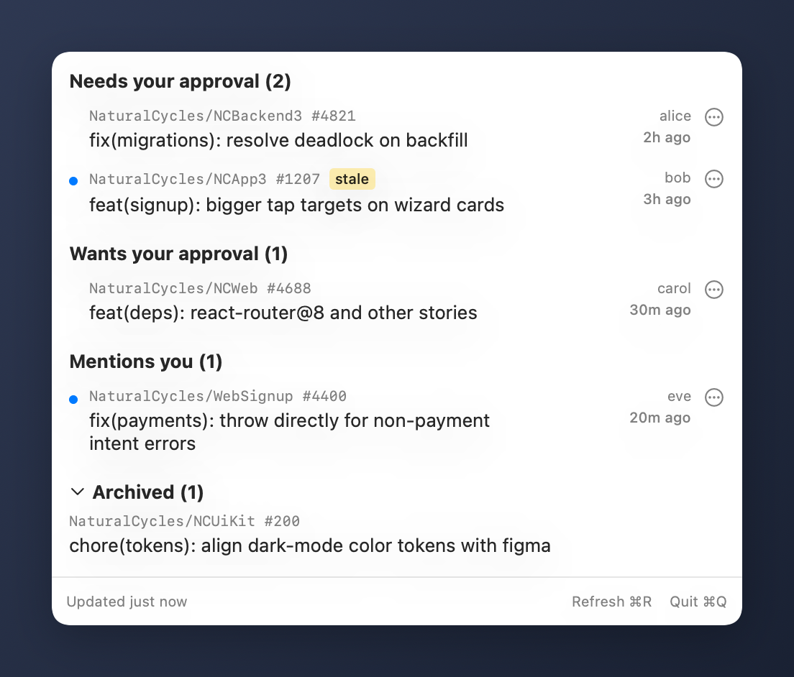

# Happy PRs

macOS menubar app showing GitHub PRs that need my input.



## Buckets

- **🔴 Needs your approval** — I (or my team) am a reviewer, and no one has approved the current HEAD yet.
- **🟡 Wants your approval** — same as above, but someone else has already approved.
- **💬 Mentions you** — I'm `@`-mentioned in the body, a comment, a review summary, or an inline review thread. Additive — can overlap with the other buckets.

Stale-approval detection: catches PRs where my prior approval was dismissed by new commits but GitHub didn't re-request me.

## Requirements

- macOS 14 (Sonoma) or newer
- [`gh`](https://cli.github.com) installed and authenticated (`gh auth login`)
- Xcode 16+ (for Swift Testing)

## Install

```sh
./install.sh
```

This builds in release mode, bundles the binary into `~/Applications/Happy PRs.app`, and registers a LaunchAgent so the app starts on login.

To update after pulling changes, re-run `./install.sh`.

## Development

```sh
./setup-hooks.sh # one-time: activates .githooks/ for this clone
./dev.sh         # swift run with the installed copy stopped
swift test       # run the test suite
```

`dev.sh` runs the binary directly via `swift run`. You'll see a transient dock icon during development — that's expected (it goes away in the bundled `.app`).

The pre-commit hook (`.githooks/pre-commit`) regenerates the README screenshot whenever a commit touches `Sources/`, and re-stages the PNG only if its content changed. Bypass with `git commit --no-verify` if you ever need to.

## Uninstall

```sh
./uninstall.sh
```

Removes the LaunchAgent, the app bundle, and stops the running process. UserDefaults settings remain unless you `defaults delete com.frodikarlsson.happyprs`.

## Tweaking settings

V1 has no Settings UI. Override via `defaults`:

```sh
# Refresh interval (allowed: 30, 60, 120, 300, 900):
defaults write com.frodikarlsson.happyprs refreshIntervalSeconds -int 30

# Hide a specific repo:
defaults write com.frodikarlsson.happyprs hiddenRepos -array "owner/noisy-repo"
```

Restart the app for changes to take effect.
