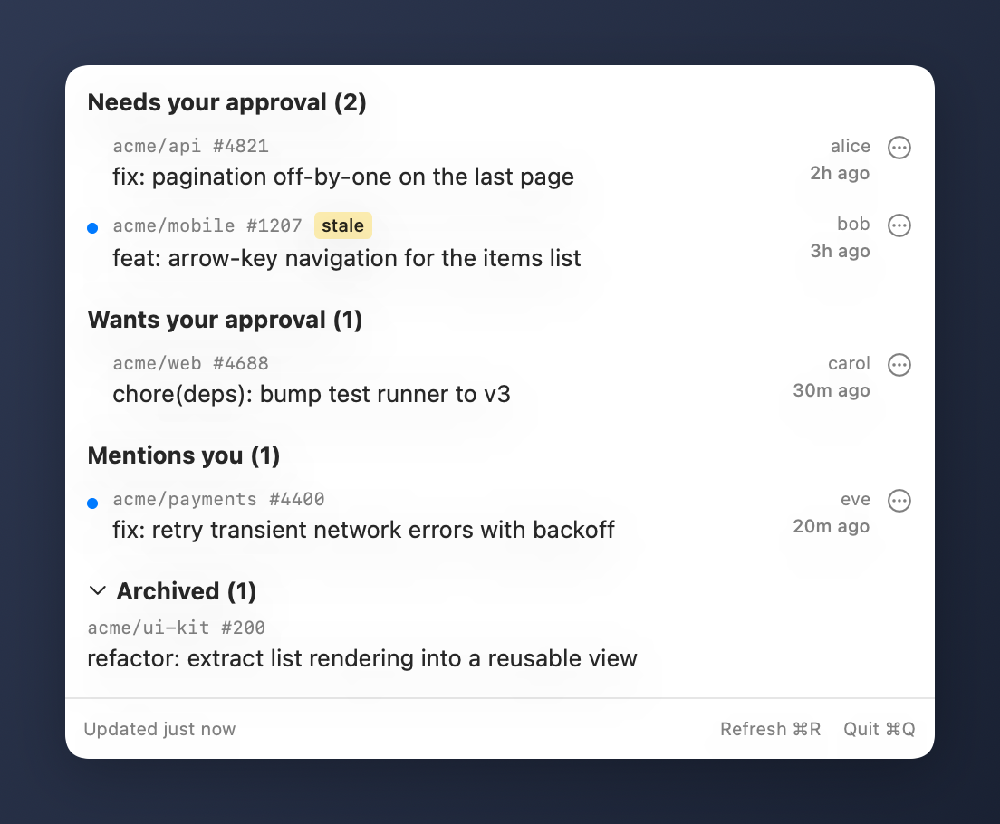
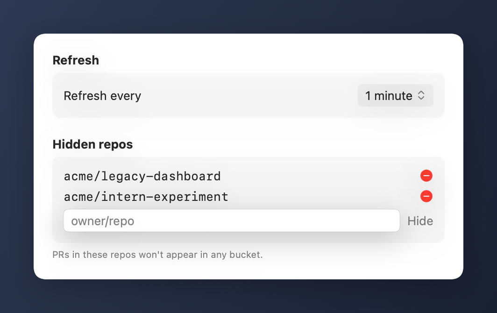

# Happy PRs

macOS menubar app showing GitHub PRs that need my input.



## Buckets

- **Needs your approval** — I (or my team) am a reviewer, and no one has approved the current HEAD yet.
- **Wants your approval** — same as above, but someone else has already approved.
- **Mentions you** — I'm `@`-mentioned in the body, a comment, a review summary, or an inline review thread. Additive — can overlap with the other buckets.

Stale-approval detection: catches PRs where my prior approval was dismissed by new commits but GitHub didn't re-request me.

## Requirements

- macOS 14 (Sonoma) or newer
- [`gh`](https://cli.github.com), authenticated via `gh auth login`. The Homebrew cask installs `gh` automatically; the from-source path requires it to be installed already.
- Xcode 16+ for the from-source / development paths only (not needed for Homebrew users).

## Install

### Homebrew (recommended)

```sh
brew install --cask frodi-karlsson/tap/happy-prs
open "/Applications/Happy PRs.app"
```

To have it start automatically on login, right-click the dock icon → **Options → Open at Login**, or add it under **System Settings → General → Login Items**.

### From source (auto-starts on login)

```sh
./install.sh
```

This builds in release mode, bundles the binary into `~/Applications/Happy PRs.app`, and registers a LaunchAgent so the app starts on login. Re-run after pulling changes to update.

## Development

```sh
./setup-hooks.sh # one-time: activates .githooks/ for this clone
./dev.sh         # swift run with the installed copy stopped
swift test       # run the test suite
```

`dev.sh` runs the binary directly via `swift run`. You'll see a transient dock icon during development — that's expected (it goes away in the bundled `.app`).

The pre-commit hook (`.githooks/pre-commit`) regenerates the README screenshots whenever a commit touches `Sources/`, and re-stages any PNG whose content changed. Bypass with `git commit --no-verify` if you ever need to.

## Uninstall

```sh
./uninstall.sh
```

Removes the LaunchAgent, the app bundle, and stops the running process. UserDefaults settings remain unless you `defaults delete com.frodikarlsson.happyprs`.

## Settings

Open with `⌘,` from the menubar popover (or click the **Settings…** button in the footer). Choose how often the app polls GitHub, and hide repos whose PRs you never want to see.


